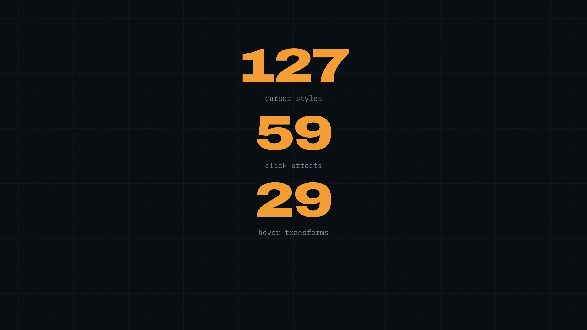

# CursorKit


<a href="https://github.com/Meet-1010/CursorKit/raw/main/cursorkit-demo.mp4">
  
</a>

> *Click the image to watch the launch video*

Custom cursors for any website, in one script tag.

```html
<script src="https://cursorkit.io/embed.js?style=magnetic-blob&click=shockwave&color=ff00ff&size=1.2"></script>
```

No npm, no build step, no framework dependency. **127 cursor styles** across ten
categories, **59 click effects**, **29 hover transforms**, and curated colour
palettes — rendered at 60fps, and legible on whatever they are over.

Categories: minimal, geometric, fluid, trails, particles, tech, playful, luxury,
neumorphic and brutalist.

---

## Repository layout

```
packages/engine     The cursor engine. Zero dependencies, TypeScript → canvas.
apps/web            The Next.js site: gallery, builder, docs, and the CDN route.
extension           Chrome extension: the builder as a popup, on any site.
```

## Getting started

```bash
npm install
npm run dev
```

`dev` builds the engine, generates the embed assets the CDN route serves, and
starts the site on <http://localhost:3000>.

| Command | What it does |
| --- | --- |
| `npm run dev` | Build the engine, then run the site |
| `npm run build` | Production build of both packages |
| `npm run extension` | Build the engine, then assemble the Chrome extension |
| `npm test` | Build the engine and run its test suite |
| `npm run size` | Report bundle sizes against the 15kb budget |
| `npm run typecheck` | Typecheck both packages |

---

## How the size target is met

The full library is ~35kb gzipped, which is far too much to ask of a site that
wants *one* cursor. So the engine compiles several ways:

| Artifact | Contents | Size |
| --- | --- | --- |
| `dist/core.js` | Engine, no styles | 8.8kb gz |
| `dist/m/s-*.js` | One chunk per style | 0.72kb gz median |
| `dist/m/e-*.js` | One chunk per effect | 0.71kb gz median |
| `dist/m/h-*.js` | One chunk per hover transform | 0.57kb gz median |
| `dist/embed.js` | Everything, self-booting | 35kb gz |
| `dist/dashboard.js` | Everything, plus the builder UI | 46kb gz |

`/embed.js?style=X&click=Y&hover=Z` is an edge route that concatenates **core
plus the one style, one effect and one hover transform** that were asked for. A
typical embed is **10.8kb gzipped**; the worst combination in the library is
**13.4kb**. The build fails if any combination would exceed 15kb.

The mechanism is the `@ck/math` import alias. In the full builds it resolves to
the real module; in chunk builds it resolves to `math-shim.ts`, which reads the
same helpers off the already-loaded core instead of inlining a second copy.
Chunks are pre-compiled IIFEs that register themselves against the core's global,
so assembling a configuration at the edge is string joining and nothing more.

**A chunked file must never import a sibling that it does not need.** Chunks are
compiled from the file a definition lives in, so a cross-file import drags that
whole file along. `hover/base.ts` and `hover/more.ts` are deliberately unaware of
each other for exactly this reason — when they were not, every hover chunk
carried every transform and the worst-case embed blew the budget. There is
a test guarding it.

## Adding a style

Styles are plugins. Export one from any file in `src/styles/` and add it to that
file's array:

```ts
export const myStyle: CursorStyle<{ spin: number }> = {
  id: 'my-style',
  name: 'My Style',
  category: 'geometric',
  blurb: 'One line, sentence case, shown in the gallery.',
  state: () => ({ spin: 0 }),
  draw({ c, p, col, scale, dt }, s) {
    s.spin += dt;
    c.fillStyle = rgba(col, 1);
    c.beginPath();
    c.arc(p.x, p.y, 10 * scale, 0, TAU);
    c.fill();
  },
};
```

That is the whole integration. The build discovers it by introspection, emits a
CDN chunk, and the site's gallery and builder pick it up from the manifest —
there is no second place to register anything.

Two conventions matter:

- **Styles are pure.** All mutable state lives in the bag returned by `state()`,
  so one definition can drive many simultaneous previews.
- **Never assign `globalAlpha`.** The engine has already set it to the cursor's
  visibility. Express transparency through `rgba()` colours, or multiply.

## The one style that is not canvas

`lens-ball` is a glass sphere that genuinely refracts the page: a displacement
texture generated at boot, fed to an `feDisplacementMap` through
`backdrop-filter: url(…)`, run three times at slightly different scales to get
the dispersion. A canvas overlay cannot do this — it has no access to the pixels
underneath it — so this style owns a DOM layer, which is why `CursorStyle` has
`hidden` and `dispose` hooks. Nothing else in the library uses them.

**Chromium refracts; Safari and Firefox frost.** Both support `backdrop-filter`
but only its shorthand functions, so `url()` silently does nothing there. The
style detects this and falls back to a blurred, brightened ball — still glass,
just without the bend. Worth knowing before it goes on a landing page.

## Testing

```bash
npm test                                   # registry, options, sizes, math
open packages/engine/test/embed.html       # embed smoke test, needs npm run dev
open packages/engine/test/audit.html       # renders every style, reports failures
```

The automated tests run against `dist/`, not source — the thing that ships is the
thing that is checked.

`audit.html` covers what Node cannot: it renders all 126 styles under simulated
motion and flags any that throw or paint nothing. Run it after touching the
engine.

---

## The embeddable dashboard

```html
<script src="https://cursorkit.io/dashboard.js?persist=1"></script>
```

Mounts the whole builder inside a customer's own site, so their team can change
the cursor against real content without a deploy in the loop. It renders in a
shadow root with its own reset, so the host's CSS cannot reach it and it cannot
reach the host's.

Two exits: **Copy tag** produces a normal ~10kb embed for production, and **Save
for this site** stores the choice in `localStorage` for the current browser only.
The panel says so itself — saving is not publishing.

Ship the tag, not the dashboard: the dashboard carries the whole library because
switching styles at runtime is its entire job.

## Deploying

The site is a Next.js app with one edge route (`/embed.js`), so anywhere that
runs Next works. Vercel is the least friction.

**Set `NEXT_PUBLIC_SITE_ORIGIN` to your real domain.** Every embed tag the
builder generates is stamped with it, so if it is wrong your visitors copy tags
pointing at a host that will not serve them. See `.env.example`.

```bash
npm run build     # builds the engine, generates embed assets, builds the site
npm start         # serve the production build locally to check it
```

`prebuild` regenerates `lib/embed-assets.generated.ts` from the engine's `dist/`,
so the CDN route always serves the freshly built chunks. Do not run `npm run
build` while `npm run dev` is up — they used to share `.next` and corrupt each
other; dev now writes to `.next-dev` to prevent it.

## Behaviour you get for free

- **Touch devices** — the script exits before drawing anything and leaves the
  native cursor alone. Nothing is hidden, no canvas is created.
- **Reduced motion** — trails, particles and magnetism are dropped, the cursor
  shape stays. `motion=full` opts out.
- **Background tabs** — the render loop stops on `visibilitychange` and restarts
  with a fresh clock, so returning never replays a backlog of frames.
- **Errors** — if a style throws, the engine tears itself down and restores the
  native cursor. A visitor is never left without a pointer.

See `/docs` on the running site for the full parameter reference and the
`data-cursor` attributes for per-element control.
